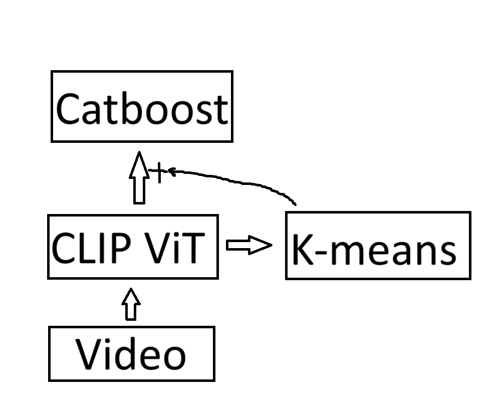

# NTO22_VideoCLF
# Задача
В рамках этапа 2 вам предстоит разработать алгоритм, который будет распределять короткие видео (длительностью менее 1 минуты) по 9 заданным классам.

## Классы:

1. **animal** - в видео присутствует одно или несколько животных.
2. **car** - в видео присутствуют автомобили.
3. **cloud** - в видео показано небо в облаках (тучах).
4. **dance** - в видео есть танцующий человек (люди).
5. **fire** - в видео присутствует пламя (огонь, пламя свечи и т.д.).
6. **flower** - в видео присутствуют цветы.
7. **food** - в видео готовят еду, либо просто присутствует еда.
8. **sunset** - в видео показан закат или рассвет.
9. **water** - в видео показана поверхность воды.
### Архитектура
{:width="100px" height="100px"}

